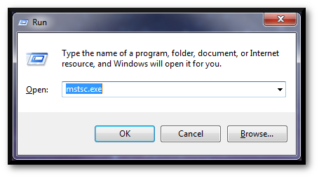
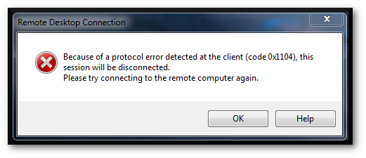
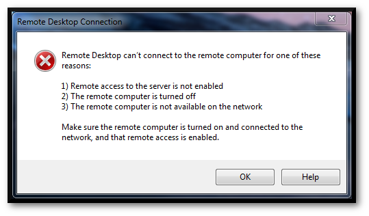

# Honey Ports

# Windows VM

### Website

<https://github.com/adhdproject/honeyports>

## Description

A Python based cross-platform HoneyPort solution, created by Paul Asadoorian.

## Install Location

```bash
~/ADCD/honeyports
```

## Example 1: Monitoring A Port With HoneyPorts

- Open an **Ubuntu Shell**


Change to the Honeyports directory and execute the latest version of the script:

```bash
cd ~/ADCD/honeyports
```

```bash
sudo python3 ./honeyports.py -p 3390 -h 0.0.0.0
```

Output:
<pre>
Honeyports Version: 0.5
I will listen on TCP port number:  3390
Honeyports detected you are running on:  Linux
</pre>
        
- We can confirm that the listening is taking place with lsof:

```bash
sudo lsof -i -P | grep python
```

Output:
<pre>
python3   36984            root    3u  IPv4 154353      0t0  TCP *:3390 (LISTEN)
</pre>

Looks like we're good.

Any connection attempts to that port will result in an instant ban for the IP address in question.
Let's simulate this next.

### Example 2: Blacklisting In Action

- If Honeyports is not listening on 3390 please follow the instructions in **[Example 1: Monitoring A Port With HoneyPorts]**.

- Once you have Honeyports online and a backup Windows machine to connect to Honeyports from, let's proceed.

- First we need to get the IP address of the ADHD instance.

```bash
ifconfig
```

Output:
```
        ens5:     flags=4163<UP,BROADCAST,RUNNING,MULTICAST>  mtu 9001
                  inet 10.10.64.184  netmask 255.255.192.0  broadcast 10.10.127.255
                  inet6 fe80::ca8:12ff:fe81:2927  prefixlen 64  scopeid 0x20<link>
                  ether 0e:a8:12:81:29:27  txqueuelen 1000  (Ethernet)
                  RX packets 35441  bytes 21695180 (21.6 MB)
                  RX errors 0  dropped 0  overruns 0  frame 0
                  TX packets 13288  bytes 1360882 (1.3 MB)
                  TX errors 0  dropped 0 overruns 0  carrier 0  collisions 0

        lo:       flags=73<UP,LOOPBACK,RUNNING>  mtu 65536
                  inet 127.0.0.1  netmask 255.0.0.0
                  inet6 ::1  prefixlen 128  scopeid 0x10<host>
                  loop  txqueuelen 1000  (Local Loopback)
                  RX packets 581  bytes 59729 (59.7 KB)
                  RX errors 0  dropped 0  overruns 0  frame 0
                  TX packets 581  bytes 59729 (59.7 KB)
                  TX errors 0  dropped 0 overruns 0  carrier 0  collisions 0
```
>[!IMPORTANT]
>
> Your IP will be **different**, use **yours**

- We can see from the `ifconfig` output that my **ADHD instance** has an IP of **10.10.64.184**

- I will connect to that IP on **port 3390** from a box on the same network segment in order to test the functionality of **Honeyports**.

- I will be using RDP to make the connection.

- To open Remote Desktop hit `Windows Key + R` and input `mstsc.exe` before hitting OK.



- Next simply tell RDP to connect to your machine's **IP address**.


- We get an almost immediate error, this is a great sign that **Honeyports** is doing its job.



- Any subsequent connection attempts are met with failure.



- And we can confirm back inside our ADHD instance that the IP was blocked.

```bash
sudo iptables -L
```

Output:
```
Chain INPUT (policy ACCEPT)
target     prot opt source               destination         
REJECT     all  --  10.10.66.204         anywhere             reject-with icmp-port-unreachable

Chain FORWARD (policy ACCEPT)
target     prot opt source               destination         

Chain OUTPUT (policy ACCEPT)
target     prot opt source               destination
```

- You can clearly see the REJECT policy for 192.168.1.149 (The address I was connecting from).

- To remove this rule we can either:

```bash
sudo iptables -D INPUT -s <<YOUR-IP>> -j REJECT
```

- Or Flush all the rules:

```bash
sudo iptables -F
```

### Example 3: Spoofing TCP Connect for Denial Of Service


- **Honeyports** are designed to only properly respond to and **block** full TCP connects.  This is done to make it difficult for an attacker to **spoof** being someone else and trick the **Honeyport** into **blocking** the **spoofed** address.  **TCP connections** are difficult to spoof if the communicating hosts properly implement secure (hard to guess) sequence numbers.  Of course, if the attacker can **"become"** the host they wish to **spoof**, there isn't much you can do to stop them.

- This example will demonstrate how to **spoof** a TCP connect as someone else, for the purposes of helping you learn to recognize the limitations of **Honeyports**.

- If you can convince the host running **Honeyports** that you are the target machine, you can send packets as the **target**.  We will accomplish this through a **MITM** attack using **ARP Spoofing**.

- Let's assume we have **two different machines**, they may be either **physical** or **virtual**.
- One must be your **ADHD machine** running **Honeyports**, the other for this example will be a **Kali box**.
- They must both be on the same **subnet**.

>[!NOTE]
> Newer **Linux** operating systems like **ADHD** often have builtin **protection** against this attack.

- This protection mechanism is found in `/proc/sys/net/ipv4/conf/all/arp_accept`. A **1** in this file means that **ADHD** is configured to **accept** unsolicited **ARP response**s.  You can set this value by running the following command

```bash
echo 1 | sudo tee /proc/sys/net/ipv4/conf/all/arp_accept
```

- If our **ADHD machine** (running the **Honeyports**) is at 192.168.1.144 and we want to spoof 192.168.1.1

>[!IMPORTANT]
>
> Your IP will be **different**, use **yours**

- Let's start by performing our **MITM attack**.

```bash
arpspoof -i eth0 -t 192.168.1.144 192.168.1.1 2>/dev/null &
```
```bash
arpspoof -i eth0 -t 192.168.1.1 192.168.1.144 2>/dev/null &
```

- If you want to confirm that the **MITM attack** is working first find the **MAC address** of the **Kali box**.

```bash
ifconfig -a | head -n 1 | awk '{print $5}
```

Output:
<pre>00:0c:29:40:1c:d3</pre>

>[!IMPORTANT]
>
> Your **MAC Address** will be **different**, use **yours**

- Then on the **ADHD machine** run this command to determine the current mapping of **IPs** to **MACs**.

```bash
arp -a
```

- Look to see if the **IP** you are attempting to **spoof** is mapped to the **MAC address** from the previous step.

- Once we have properly performed our **arpspoof** we will move on to assigning a **temporary IP** to the **Kali machine**.

- This will convince the **Kali machine** to send packets as the **spoofed host**.

```bash
ifconfig eth0:0 192.168.1.1 netmask 255.255.255.0 up
```

- The last step is to connect from the **Kali box** to the **ADHD machine** on a **Honeyport**, as `192.168.1.1`

>[!IMPORTANT]
>
> Your IP will be **different**, use **yours**

For this example, lets say that **port 3389** is a **Honeyport** as we used before in **[Example 1: Monitoring A Port With HoneyPorts]**.

```bash
nc 192.168.1.144 3389 -s 192.168.1.1
```

- It's that easy, if you list the **firewall rules** of the **ADHD machine** you should find a rule rejecting connections from `192.168.1.1`

- Mitigation of this **vulnerability** can be accomplished with either **MITM protections**, or careful monitoring of the created firewall rules.


***                                                                 
<b><i>Continuing the course? </br>[Next Lab](/IntroClassFiles/Tools/IntroClass/ADHD/openCanary.md)</i></b>

<b><i>Want to go back? </br>[Previous Lab](/IntroClassFiles/Tools/IntroClass/ADHD/Portspoof/Portspoof.md)</i></b>

<b><i>Looking for a different lab? </br>[Lab Directory](/IntroClassFiles/navigation.md)</i></b>

***Finished with the Labs?***

Please be sure to destroy the lab environment!

[Click here for instructions on how to destroy the Lab Environment](/IntroClassFiles/Tools/IntroClass/LabDestruction/labdestruction.md)

---


