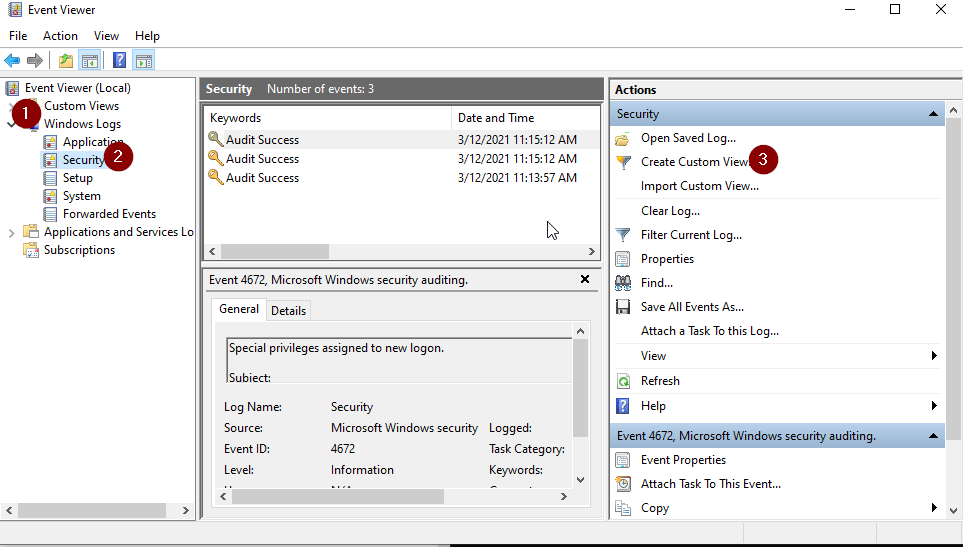
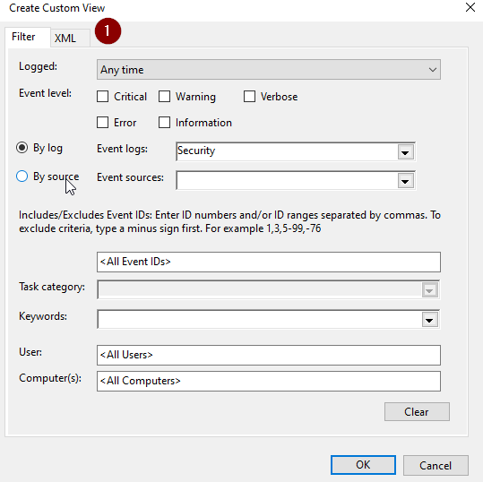
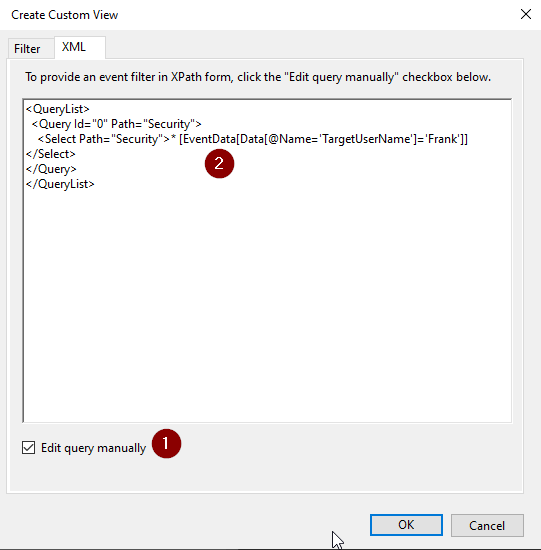
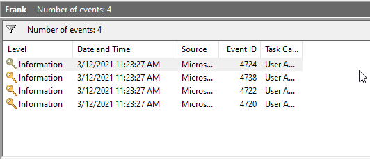
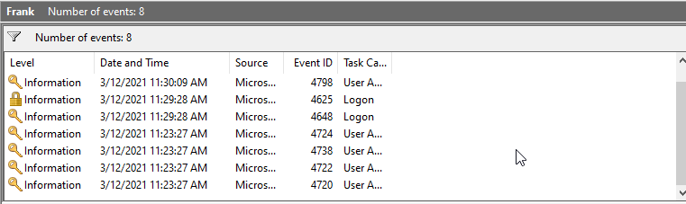

# Honey User 

# Windows VM

In this lab we will be setting up a poor persons SIEM with an "alert" generated whenever the **Honey Account Frank** is accessed. 

Why Frank? 

**Because.**

Let's get started!

- First, we will need to create the users and the Frank account. 

- Let's open a command prompt:


- Now, we will need to navigate to the C:\Tool directory and add the example users and Frank. 

```bash
cd \IntroLabs
```

```bash
200-user-gen.bat  
```

- It should look like this: 


- Now, we need to create the Custom View in **event viewer** to capture anytime someone logs in as Frank. 

- To do this click the Windows Start button then type Event Viewer. 

- It should look like this: 


- When in the **Event Viewer**, select `Windows Logs` > `Security` then `Create Custom View` on the far-right hand side. 

- It should look like this: 

 

- When `Create Custom View` opens, please select **XML**: 

 

- Then, select Edit query Manually, Press **Yes** on the **Alert Box** and then replace the text in the query with the text below: 

~~~~~~ 
<QueryList>
  <Query Id="0" Path="Security">
    <Select Path="Security">* [EventData[Data[@Name='TargetUserName']='Frank']]</Select>
  </Query>
</QueryList>

~~~~~~

- It should look like this: 

 

- Now, press **OK**. 

- When the Save Filter to Custom View box opens, name the filter Frank then press **OK**.

- When we click on our **new View** we will see the Events associated with the **Frank Account** Being Created: 

 

- Now, let's trip a few more. 

- Back at your Windows Command Prompt 

```bash
cd \IntroLabs
```

```bash
powershell
```

```bash
Set-ExecutionPolicy Unrestricted
```

```bash
Import-Module .\LocalPasswordSpray.ps1
```

- It should look like this: 


- Now, let’s try some **password spraying** against the local system! 

```bash
Invoke-LocalPasswordSpray -Password Winter2025
```

- It should look like this: 


- Now we need to clean up and make sure the system is ready for the rest of the labs: 

PS C:\Tools> `exit` 

C:\Tools> `user-remove.bat` 


- Now, let's see if any **alerts** were generated. 

- Go back to your **Event Viewer** and refresh (`Action` -> `Refresh`). 

- You should see the **"Alerts"**! 

 

- Just for a bit of reference.  We did this locally as an example of setting this up on a full SIEM.  We did it in less than 20 min.  Your SIEM team working with your AD Ops team should be able to pull this off. 

***                                                                 
<b><i>Continuing the course? </br>[Next Lab](/IntroClassFiles/Tools/IntroClass/ADHD/pcap/AdvancedC2PCAPAnalysis.md)</i></b>

<b><i>Want to go back? </br>[Previous Lab](/IntroClassFiles/Tools/IntroClass/ADHD/honeyshare/HoneyShare.md)</i></b>

<b><i>Looking for a different lab? </br>[Lab Directory](/IntroClassFiles/navigation.md)</i></b>

***Finished with the Labs?***

Please be sure to destroy the lab environment!

[Click here for instructions on how to destroy the Lab Environment](/IntroClassFiles/Tools/IntroClass/LabDestruction/labdestruction.md)

---

  

 

 


