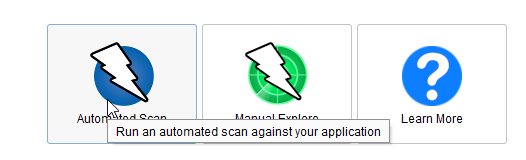

 

# Web Honeypot 

- In this lab we will be running a very simple web honeypot.  Basically, it runs a fake Outlook Web Access page and logs the attacks.  

- This is a good approach as attackers constantly go after anything that looks like an authentication portal. 

- Let's get started. 

- First we will need to open a Linux Terminal:


- Open **Ubuntu Shell**


- Now, let's start the honeypot: 

```bash
sudo docker run --rm -it -p 80:80 owa-honeypot
```

- It should look like this: 


- Now, let's start another Linux Terminal. 


- Open **Ubuntu Shell**


- Let's get your Linux IP address. 

```bash
ifconfig
```

- Then, gain a shell to the **owa-container** container. Take its CONTAINER ID with the following command.

```bash
sudo docker ps
```


- Take shell at the container.

```bash
sudo docker exec -it <CONTAINER-ID> bash
```


Now, lets tail the **dumppass log**. 

```bash
tail -f dumpass.log
``` 


- Now, let's open a browser window and surf to the **honeypot**: 

```bash
http://YOURLINUXIP
```


- Now, try a bunch of **User IDs** and **passwords**. 

- Now, go back to the Ubuntu **Terminal** with the log and you should see the **IP address** and **UserID/Password** of the attempts. 


- Now, let's attack it. 

- Select **OWASP ZAP** on your desktop. 


- Once **ZAP!** opens, select **Automated Scan**: 

 

- When Automated Scan opens, please put you Kali Linux **IP** in the URL to attack box and select **Attack**. 

- It should look like this: 


- After a while, you should see some attack strings in your Logs.


Yes...  Some attack tools are as obvious as **ZAP:ZAP**. 

***                                                                 
<b><i>Continuing the course? </br>[Next Lab](/IntroClassFiles/Tools/IntroClass/ADHD/Glastopf.md)</i></b>

<b><i>Want to go back? </br>[Previous Lab](/IntroClassFiles/Tools/IntroClass/ADHD/pcap/AdvancedC2PCAPAnalysis.md)</i></b>

<b><i>Looking for a different lab? </br>[Lab Directory](/IntroClassFiles/navigation.md)</i></b>

***Finished with the Labs?***

Please be sure to destroy the lab environment!

[Click here for instructions on how to destroy the Lab Environment](/IntroClassFiles/Tools/IntroClass/LabDestruction/labdestruction.md)

---

  

  

  

  

  

  

  

  

  

  

  

 

 


